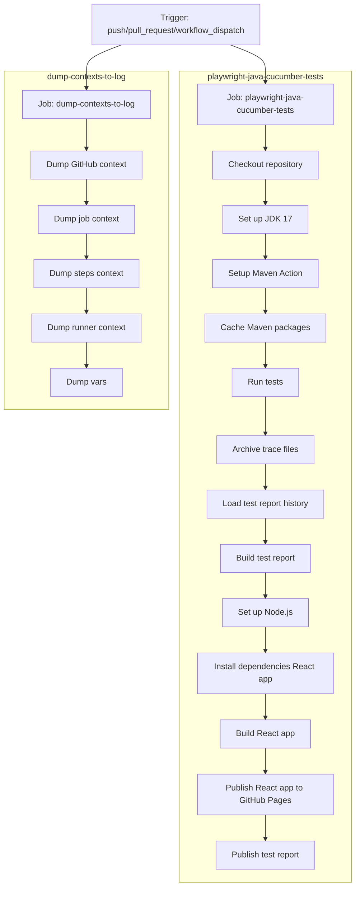

```mermaid
    flowchart TD;
    A[Trigger: push/pull_request/workflow_dispatch] --> B[Job: playwright-java-cucumber-tests]
    A --> C[Job: dump-contexts-to-log]

        subgraph playwright-java-cucumber-tests
        B1[Checkout repository]
        B2[Set up JDK 17]
        B3[Setup Maven Action]
        B4[Cache Maven packages]
        B5[Run tests]
        B6[Archive trace files]
        B7[Load test report history]
        B8[Build test report]
        B9[Set up Node.js]
        B10[Install dependencies React app]
        B11[Build React app]
        B12[Publish React app to GitHub Pages]
        B13[Publish test report]
        
        B --> B1 --> B2 --> B3 --> B4 --> B5 --> B6 --> B7 --> B8 --> B9 --> B10 --> B11 --> B12 --> B13
        end
        
        subgraph dump-contexts-to-log
        C1[Dump GitHub context]
        C2[Dump job context]
        C3[Dump steps context]
        C4[Dump runner context]
        C5[Dump vars]
        C --> C1 --> C2 --> C3 --> C4 --> C5
        end    
```